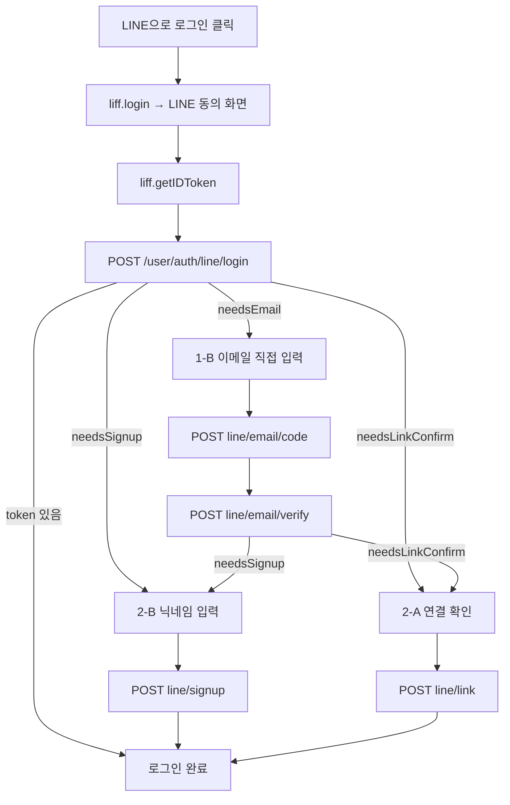

# LINE 로그인 연동 가이드 (프론트엔드용)

Seoul Moment의 LINE 로그인은 **프론트가 LINE에서 `id_token`을 받아 서버로 넘기고, 서버가 검증해 분기를 알려주는** 구조입니다. 서버는 Channel secret을 쓰지 않으며, 프론트도 비밀값을 다루지 않습니다.

이 문서는 로그인 버튼을 누른 순간부터 access token을 받기까지의 전 과정을 다룹니다.

---

## 준비물

| 값 | 예시 | 비고 |
|---|---|---|
| LIFF ID | `2011152767-mjZttzyi` | 환경변수로 관리. **공개돼도 안전** (OAuth의 client_id 성격) |
| API Base | `https://api-dev.seoulmoment.com.tw` | dev / prod 분기 |

> **Channel secret은 프론트에 절대 두지 마세요.** 현재 구조에서는 서버도 쓰지 않습니다.

LIFF 앱은 **Endpoint URL과 실제 페이지 주소가 일치해야** 초기화됩니다. dev와 prod는 주소가 다르므로 **LIFF 앱을 환경별로 하나씩** 만들고 LIFF ID만 분기하세요. 채널은 하나를 공유합니다.

---

## 전체 흐름



**판정 규칙은 하나입니다 — 응답에 `token`이 있으면 로그인 완료.** 없으면 `needsEmail` / `needsSignup` / `needsLinkConfirm` 중 무엇이 `true`인지로 다음 화면을 정합니다.

모든 정상 분기는 **HTTP 200**입니다. 가입 여부로 404를 주지 않습니다.

---

## 응답 형식

모든 응답은 `data`로 감싸집니다.

```json
{ "data": { "...": "..." } }
```

에러는 감싸지 않습니다.

```json
{ "message": "유효하지 않은 LINE idToken입니다.",
  "code": "UNAUTHORIZED",
  "traceId": "b54d2a45-48ed-4020-a64a-e222d8fb0134" }
```

문의 시 `traceId`를 함께 주시면 서버 로그에서 해당 요청을 바로 찾을 수 있습니다.

---

## 0단계 · LINE에서 id_token 받기

```js
import liff from '@line/liff';

// 앱 부팅 시 1회
await liff.init({ liffId: import.meta.env.VITE_LIFF_ID });

// 리다이렉트 복귀 처리 — init 직후 로그인 상태면 곧바로 이어서 진행
if (liff.isLoggedIn()) handleLineLogin();

async function handleLineLogin() {
  if (!liff.isLoggedIn()) {
    liff.login({ redirectUri: location.href });
    return; // ← 페이지가 떠남. 아래 코드는 실행되지 않음
  }

  const idToken = liff.getIDToken();
  if (!idToken) {
    // LIFF 앱 scope에 openid가 빠진 경우
    return alert('로그인 정보를 가져오지 못했습니다. 다시 시도해주세요.');
  }

  await postLineLogin(idToken);
}
```

**`liff.login()`은 페이지를 떠납니다.** 복귀 후 `liff.init()`이 끝나면 `isLoggedIn()`이 `true`가 되므로, **init 직후 한 번 더 호출**하는 구조여야 흐름이 이어집니다.

### 필요한 scope

| scope | 필수 | 없으면 |
|---|---|---|
| `openid` | ✅ | `getIDToken()`이 `null` — 로그인 자체 불가 |
| `email` | 권장 | 사용자가 이메일 입력 단계(1-B)를 거쳐야 함 |
| `profile` | 선택 | 닉네임 기본값·프로필 사진을 못 받음 |

`email`은 채널이 권한을 승인받아도 **사용자가 동의 화면에서 개별적으로 거부할 수 있습니다.** 거부해도 로그인은 막히지 않고 1-B 단계로 갑니다.

---

## 1단계 · 로그인 요청

```http
POST /user/auth/line/login
Content-Type: application/json

{ "idToken": "eyJraWQiOiJhMmZkNTE4MTY5..." }
```

서버가 이 토큰을 LINE에 보내 서명·만료·`aud`(우리 채널인지)를 검증하고 `sub`, `email`, `name`, `picture`를 꺼냅니다.

### 응답 4분기

| 상황 | 응답 | 다음 |
|---|---|---|
| 이미 연결된 계정 | `{ needsLinkConfirm: false, token, refreshToken }` | **완료** |
| LINE이 이메일을 안 줌 | `{ needsEmail: true, emailToken, name? }` | **1-B** |
| 미가입 | `{ needsLinkConfirm: false, needsSignup: true, email, signupToken, name? }` | **2-B** |
| 가입됨 + LINE 미연결 | `{ needsLinkConfirm: true, email, linkToken }` | **2-A** |

```js
async function postLineLogin(idToken) {
  const { data } = await api.post('/user/auth/line/login', { idToken });

  if (data.token) return saveTokens(data);                 // 완료

  if (data.needsEmail) return goEmailStep(data);           // 1-B
  if (data.needsSignup) return goSignup(data);             // 2-B
  if (data.needsLinkConfirm) return openLinkModal(data);   // 2-A
}
```

### `name` 활용

`name`은 LINE 표시 이름입니다. **닉네임 입력칸의 기본값**으로 채워주세요. 그대로 저장되지 않으며, 최종 닉네임은 사용자가 정합니다. `profile` scope 미동의 시 내려가지 않으니 optional로 처리하세요.

---

## 1-B단계 · 이메일 직접 입력 (이메일 미동의 시)

LINE이 이메일을 주지 않은 경우입니다. **로그인을 막지 않고**, 서비스에서 이메일을 받아 인증합니다. 기존 이메일 회원가입의 인증 방식과 동일합니다.

### ① 인증 코드 발송

```http
POST /user/auth/line/email/code

{ "emailToken": "eyJhbGci...", "email": "user@example.com" }
```

→ **200** (본문 없음). 6자리 코드가 메일로 발송되고 **5분간** 유효합니다.

> 이미 가입된 이메일이어도 **409가 아니라 200**입니다. 기존 계정에 LINE을 연결하는 것이 정상 경로이기 때문입니다. 회원가입용 `POST /user/auth/email/code`와 동작이 다르니 혼동하지 마세요.

### ② 코드 검증

```http
POST /user/auth/line/email/verify

{ "emailToken": "eyJhbGci...", "email": "user@example.com", "code": "123456" }
```

검증을 통과하면 **1단계와 같은 형태로** 다음 분기가 내려옵니다.

| 결과 | 응답 | 다음 |
|---|---|---|
| 미가입 | `{ needsSignup: true, email, signupToken, name? }` | **2-B** |
| 가입됨 | `{ needsLinkConfirm: true, email, linkToken }` | **2-A** |

```js
async function verifyEmail(emailToken, email, code) {
  const { data } = await api.post('/user/auth/line/email/verify', {
    emailToken, email, code,
  });

  if (data.needsSignup) return goSignup(data);
  if (data.needsLinkConfirm) return openLinkModal(data);
}
```

`emailToken`은 **LINE 계정 식별자를 서버 서명으로 담고 있습니다.** 프론트가 내용을 바꿀 수 없으며, 이메일 인증과 LINE 계정이 서버에서 묶입니다.

---

## 2-A단계 · 기존 계정에 연결

그 이메일로 가입된 계정이 있는 경우입니다. **사용자에게 확인을 받고** 진행하세요.

> `user@example.com` 계정에 LINE 로그인을 연결할까요?

```http
POST /user/auth/line/link

{ "linkToken": "eyJhbGci..." }
```

→ `{ data: { token, refreshToken } }` — **로그인 완료**

### 이 단계의 409

| 메시지 | 의미 | 안내 문구 예시 |
|---|---|---|
| `이미 다른 계정에 연결된 SNS 계정입니다.` | 이 LINE 계정이 **다른 사람 계정**에 붙어 있음 | "이 LINE 계정은 다른 계정에 연결되어 있습니다." |
| `이미 다른 SNS 계정이 연결된 계정입니다.` | **내 계정에 이미 다른 LINE**이 붙어 있음 | "이 계정에는 이미 다른 LINE 계정이 연결되어 있습니다." |

두 메시지는 원인이 반대이므로 **구분해서 안내**해야 사용자가 다음 행동을 알 수 있습니다.

---

## 2-B단계 · 신규 회원가입

```http
POST /user/auth/line/signup

{ "signupToken": "eyJhbGci...",
  "nickname": "patrick",
  "newProductAgreed": true,
  "adAgreed": false,
  "recommendAgreed": true }
```

| 필드 | 필수 | 설명 |
|---|---|---|
| `signupToken` | ✅ | 이전 단계 응답값 |
| `nickname` | ✅ | `name`을 기본값으로 채워주면 좋습니다 |
| `newProductAgreed` | | 신상품 및 기획전 출시 알림 |
| `adAgreed` | | 광고 및 이벤트 할인 이메일 |
| `recommendAgreed` | | 개인 맞춤 상품 추천 알림 |

→ `{ data: { token, refreshToken } }` — **로그인 완료**

마케팅 동의 3개는 선택이며, `true`로 보낸 항목만 동의 일시가 기록됩니다.

**409 `User nickname already exists`** — 닉네임 중복. 입력칸에 인라인 에러로 표시하고 다시 입력받으세요.

---

## 완료 후

```json
{ "data": { "token": "eyJhbGci...", "refreshToken": "eyJhbGci..." } }
```

`token`을 `Authorization: Bearer <token>` 헤더에 실어 인증이 필요한 API를 호출합니다.

### 두 번째 로그인부터는 1단계에서 끝납니다

한 번 연결되고 나면 서버가 LINE 계정 식별자로 사용자를 알아봅니다.

```
POST /user/auth/line/login  →  { token, refreshToken }
```

**이메일을 계속 미동의해도 상관없습니다.** 이메일 입력은 최초 1회뿐입니다.

---

## 토큰 수명

| 토큰 | 만료 | 용도 |
|---|---|---|
| `emailToken` | **10분** | 이메일 입력 단계 유지 |
| `signupToken` | **10분** | 닉네임 입력 화면 유지 |
| `linkToken` | **5분** | 연결 확인 모달 유지 |
| 인증 코드 | **5분** | 메일로 받은 6자리 |
| `token` (access) | 24시간 | API 호출 |
| `refreshToken` | 14일 | access token 재발급 |

**`linkToken`은 5분으로 가장 짧습니다.** 확인 모달을 띄워둔 채 사용자가 자리를 비우면 만료됩니다. 만료 시 `401`이 오므로, **0단계부터 다시 태우고** "다시 로그인해주세요"로 안내하세요.

---

## 에러 처리

| 상태 | `message` | 원인 | 대응 |
|---|---|---|---|
| 400 | `idToken should not be null or undefined` | `getIDToken()`이 `null` | LIFF scope에 `openid` 확인 |
| 400 | `code는 6자리 숫자여야 합니다.` | 코드 형식 오류 | 입력칸 검증 |
| 401 | `유효하지 않은 LINE idToken입니다.` | 토큰 만료·변조, 채널 불일치 | 재로그인 |
| 401 | `유효하지 않은 email token입니다.` | `emailToken` 만료(10분)·변조 | 0단계부터 재시작 |
| 401 | `인증 코드가 만료되었습니다.` | 5분 초과 | 코드 재발송 |
| 401 | `인증 코드가 일치하지 않습니다.` | 오입력 | 재입력 유도 |
| 401 | `유효하지 않은 link token입니다.` | `linkToken` 만료(5분) | 0단계부터 재시작 |
| 401 | `유효하지 않은 signup token입니다.` | `signupToken` 만료(10분) | 0단계부터 재시작 |
| 409 | `User nickname already exists` | 닉네임 중복 | 인라인 에러 |
| 409 | `이미 다른 계정에 연결된 SNS 계정입니다.` | 위 2-A 표 참고 | 구분 안내 |
| 409 | `이미 다른 SNS 계정이 연결된 계정입니다.` | 위 2-A 표 참고 | 구분 안내 |
| 500 | `인증 메일 발송에 실패했습니다...` | 메일 서버 장애 | 재시도 안내 |

### 재시작할 때는 LIFF 세션도 버리세요

```js
await liff.logout();
liff.login({ redirectUri: location.href });
```

**`liff.logout()` 없이 다시 로그인하면 캐시된 같은 `id_token`이 재사용됩니다.** LINE 인증을 다시 타지 않으므로 같은 에러가 반복됩니다. 실제 개발 중 무한 401 루프가 났던 원인입니다.

---

## 구현 시 유의사항

**이메일 인증을 건너뛸 수 없습니다.** `signupToken`과 `linkToken`은 코드 검증을 통과한 뒤에만 발급됩니다. 검증 없이 이메일만으로 계정을 잇는 경로는 없습니다.

**`needsEmail` 응답을 반드시 처리하세요.** 처리하지 않으면 이메일 미동의 사용자의 화면이 아무 반응 없이 멈춥니다. 백엔드는 200을 정상 반환한 상태입니다.

**모든 정상 분기가 200입니다.** 상태 코드로 분기하지 말고 **응답 본문의 플래그**로 판단하세요.

---

## 관련 문서

Swagger에서 각 API의 요청·응답 스키마와 전체 플로우 설명을 볼 수 있습니다.

```
https://api-dev.seoulmoment.com.tw/docs
→ User Auth 섹션의 line/* 엔드포인트
```
